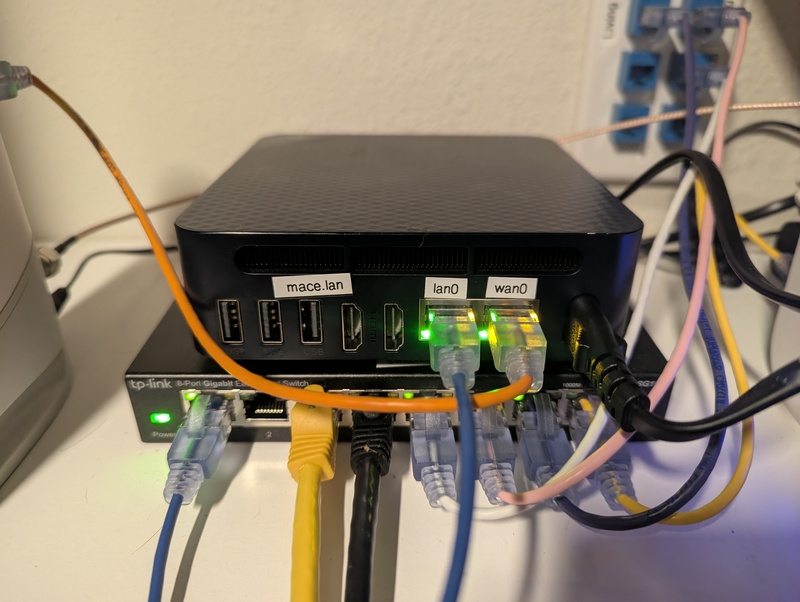

# mace (router)



This router is an Arch Linux system with the following components:

- an external interface which we name `wan0`
- an internal interface which we name `lan0`
- IPv4 forwarding between `wan0` and `lan0` enabled via sysctl
- `systemd-networkd` to define and manage the network interfaces
- `dnsmasq` to provide DHCP and DNS services to clients on `lan0`. For DNS, we
  just forward to `stubby`,
- `stubby` to provide DNS-over-TLS resolution for the router itself (dnsmasq
  cannot do DoT).
- `nftables` to provide firewall and NAT functionality between `wan0` and `lan0`
  (NAT masquerading, port forwarding, blocking unwanted traffic, etc).

In this repo, we have an [Ansible](https://www.ansible.com/) playbook and
supporting files to configure this router.

## Deployment

Deployment is done with Ansible (which can be installed with
`uv tool install ansible-core --with ansible`).

Syntax check:

```bash
ansible-playbook -i inventory.yml playbook.yml --syntax-check
```

Check and diff:

```bash
ansible-playbook -i inventory.yml playbook.yml --check --diff
```

Run the playbook:

```bash
ansible-playbook playbook.yml
```

## Common administration tasks

### Port Forwarding

See the `prerouting` chain in `etc/nftables.conf`.

### Static DHCP leases

See the `dhcp-host` entries in `etc/dnsmasq.conf`.
